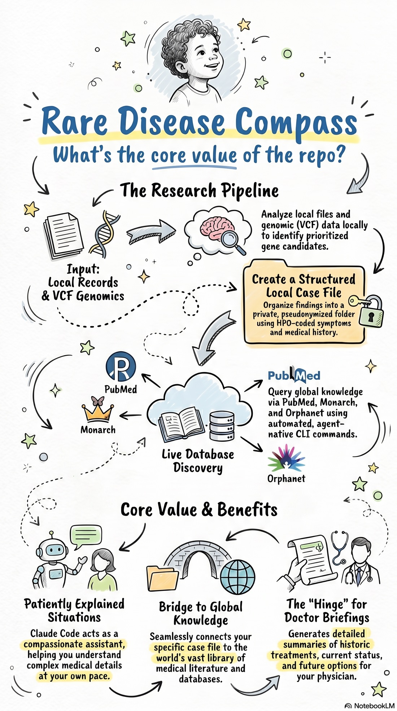

# RareDiseaseCompass

**English** · [Deutsch](README.de.md)

<p align="center">
  
</p>

A local, privacy-friendly AI research assistant for complex and rare disease
cases. Like a personal knowledge system for a single case: it connects a
**private, structured case file** (a local folder) with the **publicly available
medical knowledge** (literature, rare-disease databases, genetics) through
agent-native CLIs that you use directly in **Claude Code**.

> **Not a medical device. Not medical advice. Not a diagnosis.**
> This open-source tool is research and decision *support*. Every medical
> conclusion belongs in the hands of qualified physicians. Use at your own risk.

## The idea in one sentence

Claude Code + a set of CLIs over public medical APIs + a local folder with the
case file = a personal research assistant that always filters the world's
knowledge through your specific case. No server, no cloud infrastructure, no
installation for non-technical users beyond a one-time setup.

```
                 ┌─────────────────────────────┐
   Case file ───▶│         Claude Code         │
  (local folder) │   reads file · calls CLIs   │────▶ Answer with sources
                 └──────────────┬──────────────┘      + questions for the doctor
                                │ calls
   ┌────────────────────────────┼─────────────────────────────┐
   ▼            ▼               ▼              ▼               ▼
 PubMed     ClinVar/gnomAD   Monarch/Orphanet  PubCaseFinder  Exomiser
(literature)(variants)      (disease graph)   (DDx, HPO)     (local, genetics)
```

Each CLI is built **agent-native**: concise, composable commands with a local
SQLite history (you build up a searchable research store over time) and compound
queries that a raw API cannot answer directly.

## Quick start — let the AI install it

You don't need to know GitHub or the command line. The entire technical setup can
be done **by Claude Code itself** — you just talk to it.

**1. Install Claude Code** (Anthropic's assistant for your computer). The
[Desktop app](https://code.claude.com/docs/en/desktop-quickstart) needs no terminal
and is the easiest start — see [all install options](https://code.claude.com/docs/en/setup).
Claude Code requires a Claude **Pro / Max** subscription or an API key (it is not in
the free plan).

**2. Open Claude Code and paste this:**

> Please set up RareDiseaseCompass for me from
> `https://github.com/tombalabomba/rare-disease-compass`: download it, install its
> CLIs by following its README, and then guide me step by step, in plain language,
> through creating a private case file. I'm not technical — explain what you're
> doing, and ask me before anything leaves my computer.

Claude Code does the rest: it downloads the project, installs everything, then walks
you through your case. You answer its questions; it handles the technical parts. When
it's done, it will ask you to reopen Claude Code **inside** the new
`rare-disease-compass` folder (that loads its medical-assistant persona) — then just
say *"Help me create a case file."*

*Prefer to do it yourself in a terminal? See [Manual setup](#manual-setup-terminal) below.*

## Components

| Area | What | Epic |
|---|---|---|
| Setup | Local project layout, installer, Claude Code configuration | `setup` |
| Data CLIs | Agent-native CLIs: PubMed, ClinVar/gnomAD, Monarch, Orphanet, Europe PMC, PubCaseFinder, Phen2Gene | `cli` |
| Knowledge base | HPO-coded case-file structure, PII guard, assistant instructions | `knowledge` |
| Genetics | Exomiser locally: VCF + HPO → prioritized candidates | `genetics` |
| Experience | Companion persona, tone adaptation, skills layer, onboarding flow | `experience` |
| Community | Find others like you: patient orgs, RareConnect, recruiting trials, consent-gated genetic-matching pointers | `community` |
| Onboarding | Setup runbook, user guide, consent/privacy template | `onboarding` |

## Connected databases

All public sources are **queried live** (never copied, never filled with patient
data). Each query is also stored in a local SQLite history that powers the
"new since your last session" hint.

| Database | For | Command | Auth |
|---|---|---|---|
| **PubMed** (NCBI E-utilities) | scientific literature | `rdc pubmed` | optional API key |
| **Europe PMC** | literature incl. full text/preprints | `rdc europepmc` | none |
| **ClinVar / gnomAD / MyVariant** | meaning of a gene variant + population frequency | `rdc variant` | optional API key |
| **Monarch Initiative** | disease graph (phenotype ↔ gene ↔ disease); integrates OMIM, Orphanet, GARD, NORD | `rdc monarch` | none |
| **Orphanet** | reference for rare diseases (genes, inheritance) | `rdc orphanet` | none |
| **PubCaseFinder** | phenotype-driven differential diagnosis: HPO symptoms → ranked diseases | `rdc pubcasefinder` | none |
| **Phen2Gene** | HPO symptoms → candidate genes | `rdc phen2gene` | none |
| **Exomiser** | genetics **locally**: VCF + HPO → prioritized variants/diseases | `genetics/` (Docker) | local |
| **ClinicalTrials.gov** | recruiting clinical trials by condition/gene | `rdc trials` | none |
| **Patient orgs + RareConnect** | communities for your condition (via Orphanet + RareConnect) | `rdc community` | none |
| **Matchmaker Exchange / MyGene2** | genetic matching with others — surfaced as a **consent-gated pointer**, never auto-submitted | `rdc community matchmaking` | pointer only |

The commands can be combined (`rdc compound`), and Claude Code calls them on its
own during the conversation, depending on the question. The last entries are
**pointers**, not auto-queried: RDC links you to the right communities and explains
genetic matching, but never submits your data anywhere. Details:
[docs/architektur.md](docs/architektur.md).

## Repo structure: product vs. build tooling

Clearly separated so you immediately see what you need as a user and what only
serves development:

```
RareDiseaseCompass/
├── cli/          ← PRODUCT: the installable data CLIs (rdc)
├── skills/       ← PRODUCT: the /workflows (erklär-mir, differential, …)
├── config/       ← PRODUCT: assistant persona + tone adaptation
├── tools/        ← PRODUCT: PII guard, case-folder validation
├── genetics/     ← PRODUCT: Exomiser runner (local)
├── docs/         ← PRODUCT: user docs, templates, runbook
├── README · LICENSE · CONTRIBUTING · CLAUDE.md · AGENTS.md
└── dev/          ← BUILD TOOLING ONLY (irrelevant for users)
    ├── backlog/      tickets + planning
    └── agent-loop.sh autonomous build loop
```

**As a user you never need `dev/`.** You install the CLI (`pipx install ./cli`)
and copy `skills/`, `config/` and the templates. The `dev/` directory is the
workshop where the project is built — transparent in the repo, but not part of
the usable product.

## Manual setup (terminal)

For the technically inclined who'd rather run it themselves:

```bash
# 1. Install the CLIs
pipx install ./cli        # or the bundled scripts/install.sh

# 2. Create a case file (from docs/case-file-TEMPLATE.md), keep it local/private
# 3. Open Claude Code in the project folder and ask, e.g.:
#    "Which rare diseases match these HPO symptoms?"
```

The whole project is planned as a backlog and built autonomously, ticket by
ticket: [dev/backlog/PLAN.md](dev/backlog/PLAN.md), `bash dev/agent-loop.sh`.

## Privacy, honestly

**Be honest with yourself about this:** this is **not** a "100% private, nothing
leaves your computer" tool. Claude Code runs locally, but the AI model does not.
To answer your questions, **your inputs AND the case-file content that Claude
reads are transmitted to Anthropic.** As long as you use Claude, there is no way
around that. (If a tool sounds in videos as if everything were 1000% private: for
any cloud-based AI model, that simply isn't true.)

What the tool still does to keep your data as private as possible:

- Patient data is **never** in the repo (see [.gitignore](.gitignore)); public
  databases are only **queried**, never filled with your data.
- The case file lives in a **local folder** (optionally shared, e.g. an encrypted
  Dropbox/Nextcloud), **pseudonymized** (initials, no real names, no birth dates).
- Genetic raw data (VCF) stays **local**; only results flow into the case file.

**Privacy as far as possible — but you decide.** If you or your child has a rare
disease and you want to understand it and find help, you yourself should weigh how
much data security matters against the value of letting an AI work through the data
with you. That is a personal decision, and a legitimate one. This tool is built to
give you that choice with open eyes, not to pretend the question away.

**Is your data used to train Anthropic's models?** It depends on *how* you run
Claude Code. See Anthropic's [Privacy Policy](https://www.anthropic.com/legal/privacy)
and the article [Is my data used for model training?](https://privacy.claude.com/en/articles/10023580-is-my-data-used-for-model-training):

- **Via the API / a commercial plan** ([Commercial Terms](https://www.anthropic.com/legal/commercial-terms)) —
  inputs and outputs are **not** used to train models by default.
- **Via a Claude subscription** (Free / Pro / Max,
  [Consumer Terms](https://www.anthropic.com/legal/consumer-terms)) — Anthropic
  **may** use your conversations for training **unless** you turn off
  *"Help improve Claude"* in your
  [privacy settings](https://claude.ai/settings/data-privacy-controls). If you
  don't want training, turn it off.

When in doubt, just ask the AI of your choice about the current terms.

Full details: [docs/security.md](docs/security.md).

## Contributing / License

Open source under [GPL-3.0](LICENSE). Contributions welcome — see
[CONTRIBUTING.md](CONTRIBUTING.md). The data CLIs are usable generically, not tied
to any specific case.

## Inspiration

RareDiseaseCompass stands on the shoulders of two open-source projects:

- **[printing-press-library](https://github.com/mvanhorn/printing-press-library)** —
  the idea of **agent-native CLIs**: concise, composable commands with a local
  history, built for an AI as the operator. (RDC implements the pattern
  framework-free, without a code dependency.)
- **[dex](https://github.com/davekilleen/dex)** — the pattern of a **local,
  personal knowledge system** in Claude Code: skills, persona, session context,
  and update-safe extensibility. RDC carries this over to medical research.

Thanks to both projects for the groundwork and ideas.
