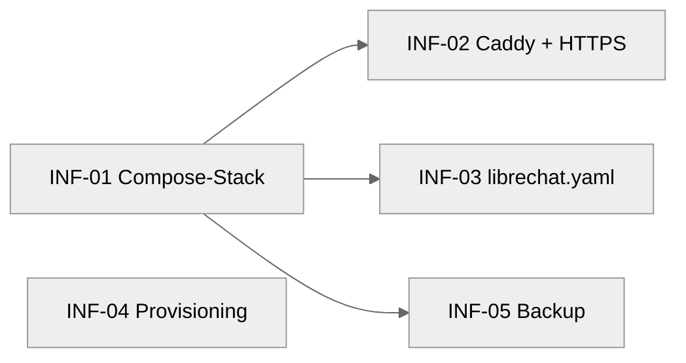

# Epic: Infrastruktur (`epic-infra`)

## Ziel

Die lauffähige, gehärtete Server-Basis für den KI-Recherche-Assistenten:
ein Docker-Compose-Stack (LibreChat + MongoDB + Meilisearch + pgvector +
RAG-API), ein Caddy-Reverse-Proxy mit automatischem HTTPS, die LibreChat-
Grundkonfiguration sowie die Skripte zum Provisionieren und verschlüsselten
Sichern eines Hetzner-Servers (Ubuntu, EU). Alles, worauf die übrigen Epics
(`knowledge`, `mcp`, `genetics`, `onboarding`) aufsetzen.

Datenschutz ist Leitplanke, nicht Nachgedanke: Es geht um Gesundheitsdaten
eines Kindes (Art. 9 DSGVO). Nur der `api`-Service ist nach außen exponiert,
alles andere bleibt im internen Docker-Netz; Backups sind verschlüsselt; das
Provisioning härtet SSH und Firewall. Siehe [docs/security.md](../../../docs/security.md)
und [docs/architektur.md](../../../docs/architektur.md).

## Aktueller Status

**geplant.** Alle fünf Tickets liegen in `tickets/`, `status: todo`. Noch nichts
implementiert. Der Server existiert physisch noch nicht — INF-04 schreibt nur das
Provisioning-Skript, der eigentliche Lauf gegen die Maschine ist ein manueller
Schritt nach diesem Epic.

## Defaults / Entscheidungen

| Thema | Entscheidung | Begründung |
|---|---|---|
| Chat-App | LibreChat (Docker) | bringt Auth, Verlauf, RAG, MCP nativ mit (CLAUDE.md) |
| App-Daten-Store | MongoDB | von LibreChat vorausgesetzt (User, Chats, Agents) |
| Volltext-Suche | Meilisearch | von LibreChat für Konversationssuche genutzt |
| Vektor-DB / RAG | Postgres + pgvector via `rag_api`-Service (`vectordb`-Container) | LibreChat-RAG-Stack |
| Reverse Proxy | Caddy | automatisches Let's-Encrypt-TLS, schlanke Config |
| TLS | Caddy automatisch (Let's Encrypt) | kein manuelles Zertifikats-Handling |
| LLM | Anthropic Claude `claude-opus-4-8` | über LibreChat-Endpoint (CLAUDE.md) |
| Registrierung | **deaktiviert** | User werden manuell angelegt (security.md) |
| Exponierung | nur `api` hinter Caddy auf 80/443 | Defense-in-Depth, alles andere intern |
| Server-OS | Ubuntu auf Hetzner Cloud (EU) | AVV + EU-Rechenzentrum (security.md) |
| Firewall | ufw, nur 22/80/443 | Mindeststandard (security.md / INF-04) |
| Secrets | `.env` (gitignored) + Server-Secret-Store | nie im Repo, nie im Ticket |
| Backup-Verschlüsselung | `age` oder `restic` | keine Klartext-Dumps am Zielpfad |

**Compose-Topologie (Soll-Zustand nach INF-01 + INF-02):**

```
            :80/:443
              │
           [caddy]  ── reverse_proxy ──▶ api:3080   (einziger exponierter Pfad)
              │
   ───────────┴─── internes Netz (kein Port-Mapping nach außen) ───────────
     api ──▶ mongodb        (App-Daten: User, Chats, Agents)
     api ──▶ meilisearch    (Volltext-Suche)
     api ──▶ rag_api ──▶ vectordb (Postgres+pgvector)   (RAG = Fallakte)
```

## Modul-Karte (welche Datei macht was)

| Datei | Verantwortung | Ticket |
|---|---|---|
| `docker-compose.yml` | Service-Definitionen (api, mongodb, meilisearch, vectordb, rag_api, caddy), Healthchecks, internes Netz, Volumes | INF-01 (Basis), INF-02 (caddy-Service ergänzt) |
| `.env.example` | Platzhalter für alle referenzierten Variablen (Keys, Secrets, DB-Credentials, RAG-Config) | INF-01 |
| `Caddyfile` | TLS-Automatik, HTTP→HTTPS-Redirect, reverse_proxy auf `api`, Security-Header | INF-02 |
| `librechat.yaml` | LibreChat-App-Config: Anthropic-Endpoint, Registrierung aus, RAG/fileConfig, Agents, `mcpServers`-Platzhalter | INF-03 |
| `scripts/provision-server.sh` | idempotentes Server-Setup: Docker, Deploy-User, ufw, fail2ban, unattended-upgrades, SSH-Härtung | INF-04 |
| `scripts/backup.sh` | verschlüsseltes Backup von Mongo + Postgres + Volumes, Retention | INF-05 |

## Tickets & `depends_on`-Graph

| ID | Titel | depends_on | commit_type | stop_after |
|---|---|---|---|---|
| INF-01 | Docker-Compose-Stack (LibreChat + MongoDB + Meilisearch + pgvector + rag_api) | — | feat(infra) | false |
| INF-02 | Caddy Reverse Proxy + HTTPS + Security-Header | INF-01 | feat(infra) | false |
| INF-03 | LibreChat `librechat.yaml` (Anthropic, Registrierung aus, RAG, Agents, mcpServers-Platzhalter) | INF-01 | feat(infra) | false |
| INF-04 | Hetzner-Provisioning-Skript (Docker, Firewall, Härtung) | — | feat(infra) | false |
| INF-05 | Verschlüsseltes Backup-Skript (Mongo + Postgres + Volumes) | INF-01 | feat(infra) | false |



**Baureihenfolge:** INF-01 und INF-04 sind unabhängig und ziehbar zuerst.
Nach INF-01 öffnen sich INF-02, INF-03 und INF-05 parallel. Der Loop wählt bei
mehreren Kandidaten die kleinste ID.

## Out of scope (Epic-weit)

- Eigentliches Provisionieren/Deployen gegen die echte Maschine (manuell, nach Epic).
- MCP-Server-Definitionen im `mcpServers`-Block — kommen aus `epic-mcp` (MCP-01/MCP-06).
- Fallakten-Schema, Pseudonymisierung, RAG-Ingestion — `epic-knowledge`.
- Smoke-/Live-Tests gegen den laufenden Stack — `2.ready/epic-infra/SMOKE-TEST.md`
  (vom Menschen am Epic-Ende), nicht Teil der maschinellen Acceptance.
