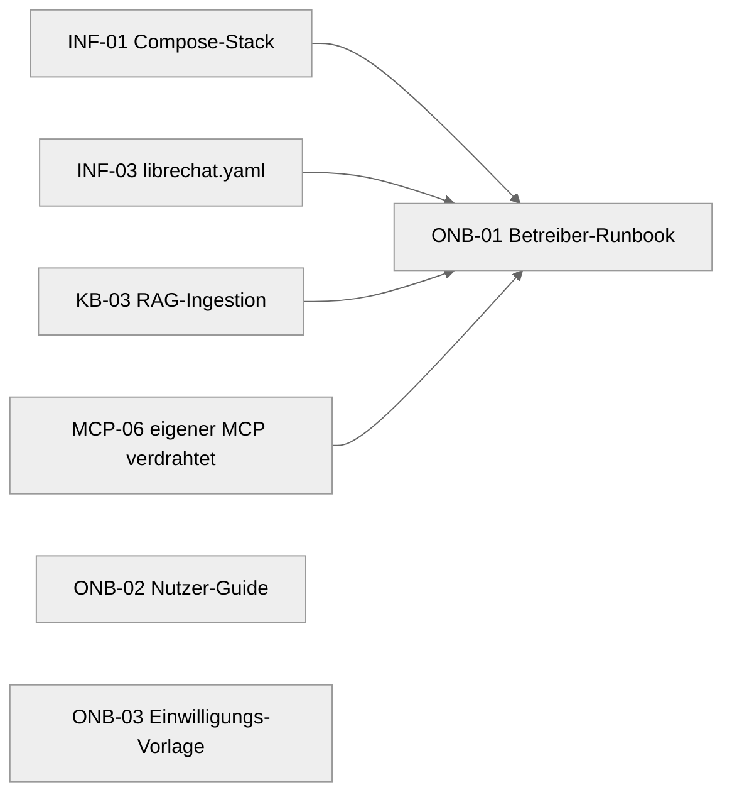

# Epic: Onboarding (`epic-onboarding`)

## Ziel

Die menschliche Schnittstelle zum System: Dokumentation, die das fertige Setup
für beide Rollen bedien- und betreibbar macht. Drei Doku-Artefakte:

- ein **Betreiber-Runbook** für Thomas (Provisionieren, Starten, User anlegen,
  Akte aktualisieren, Backups, Updates, Troubleshooting),
- ein **Nutzer-Guide** für Matze in einfacher Sprache (Login, gute Fragen stellen,
  was das System kann und was nicht),
- eine **Einwilligungs- und Datenschutz-Vorlage** für den Sorgeberechtigten
  (Zweck, gespeicherte Daten, Anthropic-API/DPA, Rechte, Vertrags-Checkliste).

Dieses Epic schreibt **nur Doku** — keinen Code, keine Configs. Es setzt inhaltlich
auf den anderen Epics auf (Infra, Knowledge, MCP), beschreibt aber lediglich deren
Bedienung. Es geht um Gesundheitsdaten eines Kindes (Art. 9 DSGVO), darum ist die
Einwilligungs-/Datenschutz-Doku Teil des Epics, nicht ein Nachgedanke. Siehe
[docs/security.md](../../../docs/security.md) und
[docs/architektur.md](../../../docs/architektur.md).

## Aktueller Status

**geplant.** Alle drei Tickets liegen in `tickets/`, `status: todo`. Noch nichts
geschrieben. ONB-02 (Nutzer-Guide) und ONB-03 (Einwilligungs-Vorlage) sind ohne
Dependencies sofort ziehbar. ONB-01 (Betreiber-Runbook) wartet auf die Tickets,
deren Bedienung es dokumentiert (INF-01, INF-03, KB-03, MCP-06) — ein Runbook über
noch nicht existierende Configs/Skripte wäre Spekulation.

## Defaults / Entscheidungen

| Thema | Entscheidung | Begründung |
|---|---|---|
| Sprache der Doku | Deutsch (Nutzer-sichtbar) | CLAUDE.md, Sprach-Konvention |
| Zielordner | `docs/` (neben `architektur.md`, `security.md`) | konsistent mit bestehender Doku |
| Patientendaten in Doku | **keine** echten, nur synthetische Beispiele | CLAUDE.md, docs/security.md |
| Runbook-Tonalität | Schritt-für-Schritt, kopierbare Befehle | Betreiber führt es live aus |
| User-Guide-Tonalität | einfache Sprache, kein Technik-Jargon, kein Code | Matze ist Nutzer, kein Techniker |
| Einwilligungs-Vorlage | klar als **Vorlage** markiert, **kein** Rechtsrat | wir sind keine Juristen (docs/security.md) |
| Registrierung | aus — User werden manuell angelegt | docs/security.md, INF-03 |
| Keine Diagnose | überall betont (README-Disclaimer) | README, kein Medizinprodukt |

## Modul-Karte (welche Datei macht was)

| Datei | Verantwortung | Ticket |
|---|---|---|
| `docs/runbook.md` | Betreiber-Handbuch: Provisionierung, Start/Stop, librechat.yaml/Secrets, User anlegen, Akte aktualisieren + neu ingestieren, MCP-Tools prüfen, Backup/Restore, Update/Key-Rotation, Troubleshooting | ONB-01 |
| `docs/user-guide.md` | Nutzer-Handbuch (Matze): Login, gute Fragen, Beispiel-Fragen, Grenzen (keine Diagnose), Quellen lesen, Datenschutz einfach erklärt | ONB-02 |
| `docs/consent-template.md` | Einwilligungs-/Datenschutz-Vorlage für den Sorgeberechtigten + Vertrags-Checkliste (Hetzner AVV, Anthropic DPA) | ONB-03 |

## Tickets & `depends_on`-Graph

| ID | Titel | depends_on | commit_type | stop_after |
|---|---|---|---|---|
| ONB-01 | Betreiber-Runbook (Thomas) | INF-01, INF-03, KB-03, MCP-06 | docs(onboarding) | false |
| ONB-02 | Nutzer-Guide (Matze) | — | docs(onboarding) | false |
| ONB-03 | Einwilligungs- & Datenschutz-Vorlage | — | docs(onboarding) | false |

**Baureihenfolge:** ONB-02 und ONB-03 sind unabhängig und sofort ziehbar; der Loop
wählt bei mehreren Kandidaten die kleinste ID, also ONB-02 vor ONB-03. ONB-01 zieht
der Loop erst, wenn INF-01, INF-03, KB-03 und MCP-06 in einem `done/`-Ordner liegen
— sonst beschriebe das Runbook Dateien, die es noch gar nicht gibt.

## Out of scope (Epic-weit)

- Jeglicher Code, Config oder Skript — dieses Epic ist reine Doku. Configs und
  Skripte kommen aus `epic-infra`, `epic-knowledge`, `epic-mcp`, `epic-genetics`.
- Tatsächliches Provisionieren/Deployen gegen die echte Maschine (manuell).
- Rechtsverbindliche Einwilligungs- oder Vertragsdokumente — ONB-03 liefert eine
  **Vorlage**, keine geprüfte Rechtsberatung.
- Echte Patientendaten in Beispielen — nur synthetische, erfundene Inhalte.
- Smoke-/Live-Tests gegen den laufenden Stack — `2.ready/epic-onboarding/SMOKE-TEST.md`
  (vom Menschen am Epic-Ende), nicht Teil der maschinellen Acceptance.
