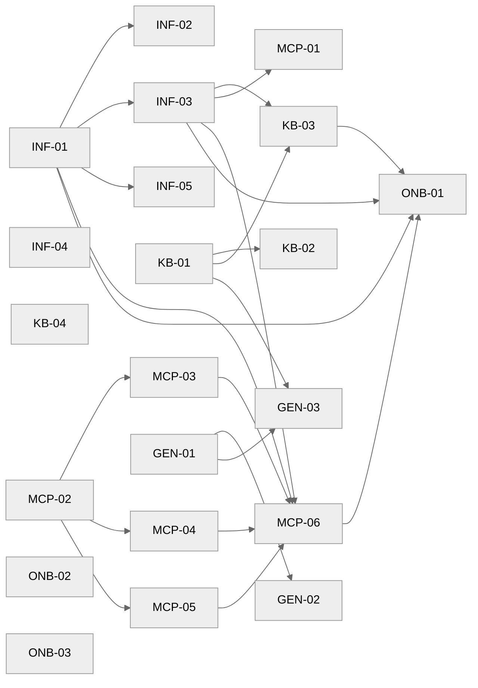

# Projektplan — rare-case-assistant

Die Gesamtübersicht für Mensch und Loop. Jeder frische Loop-Lauf liest diese
Datei zur Orientierung, bevor er ein Ticket zieht (hält den Kontext klein).

## Ziel
Selbst-gehosteter KI-Recherche-Assistent: private Fallakte (RAG) + öffentliche
Medizin-Datenbanken (MCP) + LibreChat-Chat, auf einem Hetzner-Server (EU).
Siehe [../docs/architektur.md](../docs/architektur.md).

## Zwei Phasen

**Phase A — Bauen (autonom, `scripts/agent-loop.sh`).** Der Loop baut die komplette
Software aus `2.ready/`: Compose-Stack, Configs, MCP-Server, Fallakten-Schema,
Genetik-Pipeline, Doku. Jede Acceptance ist lokal maschinell prüfbar (lint, build,
config-validate, unit-tests) — **ohne** laufenden Server. Endet sauber, wenn
`2.ready/` leer ist.

**Phase B — Deployen & Login (supervised, `1.planning/DEP-*`).** Das tatsächliche
Aufsetzen auf dem Hetzner-Server, Secrets, DNS, Stack-Start, User-Anlage für
Matze + Thomas. Braucht echte Zugänge → läuft **nicht** unbeaufsichtigt, sondern
in einer gemeinsamen Session (du gibst Server-Zugang, Claude führt durch). Liegt
bewusst in `1.planning/`, damit der autonome Loop es nicht zieht. Promoten nach
`2.ready/`, wenn du deployen willst.

## Epics (Phase A)

| Epic | Tickets | Ziel | hängt ab von |
|---|---|---|---|
| `infra` | INF-01…05 | Docker-Stack (LibreChat + pgvector/RAG), Caddy/HTTPS, Provisioning, Backups | — |
| `knowledge` | KB-01…04 | HPO-Fallakten-Schema, PII-Guard, RAG-Ingestion, System-Prompt | infra |
| `mcp` | MCP-01…06 | BioMCP + eigener MCP (Monarch, Orphanet, Europe PMC, PubCaseFinder, Phen2Gene) | infra |
| `genetics` | GEN-01…03 | Exomiser lokal: VCF + HPO → Kandidaten → Akte | knowledge |
| `onboarding` | ONB-01…03 | Betreiber-Runbook, Nutzer-Guide, Einwilligungs-Vorlage | infra, knowledge, mcp |

## Modul-Karte (Datei → Ticket)

| Pfad | Verantwortung | Ticket |
|---|---|---|
| `docker-compose.yml` | LibreChat + MongoDB + Meilisearch + pgvector + rag_api (+ caddy, + mcp-server) | INF-01, INF-02, MCP-06 |
| `Caddyfile` | TLS, HTTPS-Redirect, Security-Header, Reverse Proxy | INF-02 |
| `librechat.yaml` | Anthropic-Endpoint, Registrierung aus, RAG, Agents, mcpServers | INF-03, MCP-01, MCP-06 |
| `.env.example` | alle Secrets als Platzhalter | INF-01 |
| `scripts/provision-server.sh` | Hetzner-Härtung (Docker, ufw, fail2ban, SSH) | INF-04 |
| `scripts/backup.sh` | verschlüsseltes Mongo/Postgres/Volume-Backup | INF-05 |
| `docs/case-file-TEMPLATE.md` | HPO-codierte Fallakten-Struktur | KB-01 |
| `tools/pii_guard.py` | PII-Leck-Prüfung | KB-02 |
| `tools/ingest_case_file.py` | Fallakte → RAG (ruft PII-Guard) | KB-03 |
| `config/system-prompt.md` | Agent-Instruktionen (keine Diagnose, Quellen, Arztfragen) | KB-04 |
| `mcp-server/` | eigener FastMCP-Server + Tools | MCP-02…06 |
| `docs/mcp-biomcp.md` | BioMCP-Anbindung | MCP-01 |
| `genetics/` | Exomiser-Runner + Konverter | GEN-01…03 |
| `docs/runbook.md` | Betreiber-Runbook | ONB-01 |
| `docs/user-guide.md` | Nutzer-Guide (Matze) | ONB-02 |
| `docs/consent-template.md` | Einwilligungs-/Datenschutz-Vorlage | ONB-03 |

## Abhängigkeitsgraph

**Sofort ziehbar (keine Dependencies):** GEN-01, INF-01, INF-04, KB-01, KB-04,
MCP-02, ONB-02, ONB-03 — der Loop hat also von Beginn an genug parallele Startpunkte.
