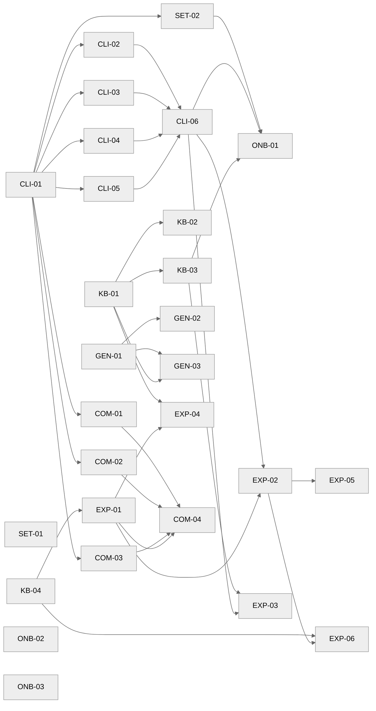

# Projektplan — RareDiseaseCompass

Die Gesamtübersicht für Mensch und Loop. Jeder frische Loop-Lauf liest diese
Datei zur Orientierung, bevor er ein Ticket zieht (hält den Kontext klein).

## Ziel
Ein lokaler KI-Recherche-Assistent für seltene Krankheitsfälle: private Fallakte (lokaler Ordner) + öffentliche Medizin-Datenbanken
(agenten-native CLIs) + Claude Code. **Kein Server.** Open Source (MIT).
Siehe [../../docs/architektur.md](../../docs/architektur.md).

## Bauen (autonom)
`dev/agent-loop.sh` baut die komplette Software aus `2.ready/` — CLIs,
Fallakten-Schema, PII-Guard, Genetik-Pipeline, Doku. Jede Acceptance ist lokal
maschinell prüfbar (ruff, pytest, shellcheck, config-validate). Kein laufender
Server nötig. Endet sauber, wenn `2.ready/` leer ist.

Das einmalige Einrichten auf einer Maschine (CLIs installieren, Claude Code
konfigurieren, Fallakte anlegen) ist im Setup-/Onboarding-Epic dokumentiert und
ein menschlicher, einmaliger Schritt — kein Server-Deployment.

## CLI-Stil
Die Daten-CLIs sind **agenten-nativ** (knappe, kombinierbare Befehle mit lokaler
SQLite-History) und bewusst **framework-frei** gebaut (Typer + httpx + SQLite),
damit das OSS-Repo keine proprietäre Laufzeit-Abhängigkeit hat.

## Epics

| Epic | Tickets | Ziel | hängt ab von |
|---|---|---|---|
| `setup` | SET-01…02 | Projekt-Layout, Fallakten-Ordner-Konvention, CLI-Installer | cli (SET-02) |
| `cli` | CLI-01…06 | Agenten-native CLIs: Literatur, Varianten, Krankheits-Graph, DDx + Compound Queries | — |
| `knowledge` | KB-01…04 | HPO-Fallakten-Schema, PII-Guard, Ordner-Konvention, Assistenten-Instruktionen | — |
| `genetics` | GEN-01…03 | Exomiser lokal: VCF + HPO → Kandidaten → Akte | knowledge |
| `experience` | EXP-01…06 | Companion-Persona + Ton-Adaption, Skills-Schicht, Session-Kontext, Onboarding-Flow, Erweiterbarkeit, Report-Lesbarkeit | cli, knowledge |
| `community` | COM-01…04 | „Finde deine Leute": Patientenorgs/RareConnect, klinische Studien, Matching-Wegweiser (kein Auto-Submit), Skill | cli, knowledge, experience |
| `onboarding` | ONB-01…03 | Setup-Runbook, Nutzer-Guide, Einwilligungs-Vorlage | setup, cli, knowledge |

## Modul-Karte (Datei → Ticket)

| Pfad | Verantwortung | Ticket |
|---|---|---|
| `docs/project-layout.md` | Ordnerstruktur, Fallakten-Ablage (lokaler Ordner, optional geteilt), Claude-Code-Konfig | SET-01 |
| `cli/` (Installer/Skript) | CLIs auf einer Maschine installieren, API-Keys konfigurieren | SET-02 |
| `cli/` (Kern) | Typer-App, httpx-Client, SQLite-History, Ausgabeformat | CLI-01 |
| `cli/.../literature.py` | PubMed + Europe PMC | CLI-02 |
| `cli/.../variant.py` | ClinVar / gnomAD / MyVariant | CLI-03 |
| `cli/.../graph.py` | Monarch + Orphanet | CLI-04 |
| `cli/.../ddx.py` | PubCaseFinder + Phen2Gene (HPO) | CLI-05 |
| `cli/.../compound.py` + `docs/cli-guide.md` | Compound Queries + Claude-Nutzungs-Guide | CLI-06 |
| `docs/case-file-TEMPLATE.md` | HPO-codierte Fallakten-Struktur | KB-01 |
| `tools/pii_guard.py` | PII-Leck-Prüfung | KB-02 |
| `docs/case-folder.md` + `tools/validate_case_folder.py` | Ordner-Konvention + Validierung | KB-03 |
| `config/assistant-instructions.md` | Assistenten-Persona (keine Diagnose, Quellen, Arztfragen) | KB-04, EXP-01 |
| `config/case-profile.example.yaml` | Ton-/Vorwissen-Adaption (medical_literacy, tone, goals) | EXP-01 |
| `skills/<name>/SKILL.md` | Skills-Schicht (erklaer-mir, differential, variante, arzttermin-vorbereiten, spezialisten-finden, was-ist-neu) | EXP-02 |
| `scripts/session-context.sh` | Fallstand + neue Literatur beim Start | EXP-03 |
| `skills/fall-anlegen/SKILL.md` | Geführter Onboarding-Flow | EXP-04 |
| `skills/skill-erstellen/SKILL.md` + `docs/extending.md` | Erweiterbarkeit (-custom-Schutz) | EXP-05 |
| `config/assistant-instructions.md` + differential/erklaer-mir `## Output` | Report-Lesbarkeit (Hypothesen, klickbare Quellen, Klartext-Tabellen) | EXP-06 |
| `cli/rdc/sources/community.py` | `rdc community`: Patientenorgs + RareConnect | COM-01 |
| `cli/rdc/sources/trials.py` | `rdc trials`: ClinicalTrials.gov | COM-02 |
| `docs/connect-genetic-matching.md` + `rdc community matchmaking` | Matching-Wegweiser (MME/MyGene2), kein Auto-Submit | COM-03 |
| `skills/finde-deine-leute/SKILL.md` | Community-Workflow (führt COM-01..03 zusammen) | COM-04 |
| `genetics/` | Exomiser-Runner + Konverter | GEN-01…03 |
| `docs/runbook.md` | Setup-Runbook (Einrichten auf einer Maschine) | ONB-01 |
| `docs/user-guide.md` | Nutzer-Guide | ONB-02 |
| `docs/consent-template.md` | Einwilligungs-/Datenschutz-Vorlage | ONB-03 |

## Abhängigkeitsgraph

**Sofort ziehbar (keine Dependencies):** SET-01, CLI-01, KB-01, KB-04, GEN-01,
ONB-02, ONB-03 — genug parallele Startpunkte für den Loop.
