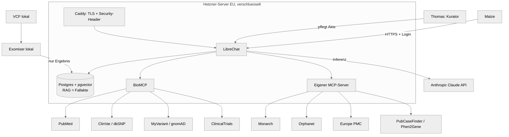

# Architektur

## Überblick

Drei Schichten, sauber getrennt:

1. **Fallakte (privat)** — die strukturierte, HPO-codierte, pseudonymisierte
   Krankengeschichte. Lebt als RAG-Wissensbasis im LibreChat-Stack auf dem Server.
   Die Genetik-**Rohdaten** (VCF) verlassen den lokalen Rechner nie; nur die
   abgeleitete Ergebnis-Zusammenfassung wandert in die Akte.
2. **Welt-Wissen (öffentlich)** — medizinische Datenbanken, live abgefragt über
   MCP-Werkzeuge. Nichts davon wird kopiert oder mit der Fallakte gefüttert.
3. **Reasoning (Claude)** — kombiniert 1 und 2 im Chat, nennt Quellen, schlägt
   Fragen für den nächsten Arzttermin vor.

## Komponentenverantwortung

| Komponente | Verantwortung | Läuft wo |
|---|---|---|
| Caddy | TLS-Terminierung, HTTPS-Redirect, Security-Header, Reverse Proxy | Server |
| LibreChat | Auth (manuelle User), Chat-Verlauf, Agent-Konfiguration, RAG, MCP-Client | Server |
| Postgres + pgvector | Nutzer/Verlauf + Vektor-Store der Fallakte | Server |
| BioMCP | Fertige MCP-Tools: PubMed, ClinVar, dbSNP, MyVariant, ClinicalTrials | Server (Container) |
| Eigener MCP | Monarch, Orphanet, Europe PMC, PubCaseFinder, Phen2Gene | Server (Container) |
| Exomiser | VCF + HPO → priorisierte Varianten/Krankheiten | **Lokal** (Datensparsamkeit) |

## Datenfluss

1. Thomas strukturiert die Befunde → HPO-codierte Fallakte (`epic-knowledge`).
2. (Falls VCF vorhanden) Exomiser lokal → Ergebnis-Markdown → Teil der Fallakte.
3. Fallakte wird in die RAG-Wissensbasis geladen (Ingestion-Skript).
4. Matze chattet. LibreChat reichert die Frage mit relevanten Akten-Auszügen an
   (RAG) und stellt Claude die MCP-Tools bereit.
5. Claude fragt bei Bedarf live die Datenbanken ab und antwortet mit Quellen.

## Warum diese Wahl

- **LibreChat statt Eigenbau:** gewartet, bringt Auth + RAG + MCP nativ mit.
  Ein Eigenbau wäre genau die unwartbare Bastelei, die wir vermeiden wollen.
- **Monarch statt eigenem Knowledge-Graph:** Monarch integriert bereits 33 Quellen
  (OMIM, Orphanet, GARD, NORD). Nicht nachbauen, anbinden.
- **BioMCP als Bündel:** deckt fünf Genetik-/Literatur-Quellen in einem Schritt ab.
- **Exomiser lokal:** das Allersensibelste (Rohgenom) bleibt in-house.

## Schnittstellen (öffentliche Quellen)

| Quelle | Zugriff | Auth |
|---|---|---|
| PubMed / NCBI E-utilities | REST | optional API-Key (höheres Rate-Limit) |
| Europe PMC | REST | keine |
| Monarch Initiative | REST API | keine |
| Orphanet | REST / Orphadata | teils Registrierung |
| PubCaseFinder | REST API | keine |
| Phen2Gene | REST API | keine |
| ClinVar / dbSNP / MyVariant | über BioMCP | optional API-Key |
| ClinicalTrials.gov | über BioMCP | keine |
