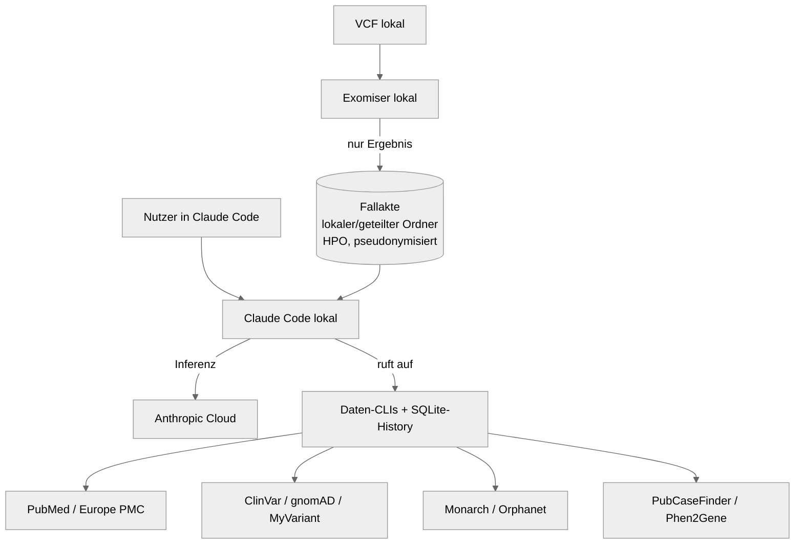

# Architektur

## Überblick

Bewusst minimal, lokal, kein Server. Drei Schichten:

1. **Fallakte (privat)** — HPO-codierte, pseudonymisierte Krankengeschichte als
   Markdown in einem **lokalen Ordner**. Sollen zwei Personen denselben Ordner
   nutzen (einer kuratiert, einer liest mit), kann er optional über einen
   geteilten, verschlüsselten Ordner laufen (z. B. Dropbox, Nextcloud) — Pflicht
   ist das nicht. Die Genetik-**Rohdaten** (VCF) bleiben lokal und außerhalb eines
   etwaigen geteilten Ordners.
2. **Welt-Wissen (öffentlich)** — medizinische Datenbanken, abgefragt über
   agenten-native CLIs. Nichts wird kopiert oder mit der Fallakte gefüttert.
3. **Reasoning (Claude Code)** — liest die Akte als Dateien, ruft die CLIs auf,
   kombiniert beides, nennt Quellen, schlägt Arztfragen vor.

## Warum CLIs statt MCP-Server

In einer Web-App wäre MCP der einzige Weg, dem Modell Werkzeuge zu geben. In
Claude Code gibt es eine Shell — damit sind CLIs die natürlichere, präzisere Wahl:

- **Lokale SQLite-History** → ein über Monate wachsender, durchsuchbarer
  Recherche-Speicher (welche Paper, Varianten, Krankheiten schon angesehen wurden).
  Ein zustandsloser MCP-Server gäbe das nicht.
- **Compound Queries** → mehrere Quellen kombiniert (z. B. „Paper zu Gen X UND
  Variante Y bei Kindern < 6"), was eine rohe API nicht direkt kann.
- **Präzision & wenig Token** → knappe, kontrollierte Ausgabe statt verbose JSON.
- **Inspizierbar** → denselben Befehl kann ein Mensch im Terminal nachvollziehen.
- **Ein Install, kein laufender Server.**

Geringer Lock-in: Die wertvolle Logik ist die API-Anbindung. Sie ließe sich später
mit überschaubarem Aufwand auch als MCP-Server verpacken (falls je eine Web-Tür
für nicht-technische Nutzer gewünscht ist).

## CLI-Design (Printing-Press-Muster)

| Eigenschaft | Umsetzung |
|---|---|
| Einheitlicher Einstieg | eine CLI mit Subkommandos pro Quelle |
| HTTP | zentraler httpx-Client: Cache, höfliches Rate-Limit, Retry, Timeout, User-Agent |
| History/Cache | lokale SQLite-DB pro Projekt (gitignored) |
| Ausgabe | knappes, agenten-freundliches Format (Tabellen/JSON-Lines), Quellen-IDs |
| Compound Queries | quellenübergreifende Abfragen, die die SQLite-History nutzen |

OSS-Hinweis: Der CLI-Kern wird framework-frei gebaut (Typer + httpx + SQLite), damit
das Repo keine proprietäre Abhängigkeit hat. Das PP-*Muster* wird übernommen, nicht
zwingend eine PP-*Laufzeit*.

## Schnittstellen (öffentliche Quellen)

| Quelle | Zugriff | Auth | CLI |
|---|---|---|---|
| PubMed / NCBI E-utilities | REST (oder Entrez Direct) | optional API-Key | `cli pubmed` |
| Europe PMC | REST | keine | `cli europepmc` |
| ClinVar / dbSNP / MyVariant / gnomAD | REST (MyVariant.info) | optional | `cli variant` |
| Monarch Initiative | REST API | keine | `cli monarch` |
| Orphanet / Orphadata | REST | teils Registrierung | `cli orphanet` |
| PubCaseFinder | REST API (HPO-IDs) | keine | `cli pubcasefinder` |
| Phen2Gene | REST API (HPO-IDs) | keine | `cli phen2gene` |

## Genetik (lokal)

Exomiser läuft als lokaler Docker-Batch gegen VCF + HPO-Terme und priorisiert
Varianten/Krankheiten. Nur die kuratierte Ergebnis-Zusammenfassung (keine Rohzeilen)
wird in die Fallakte übernommen. Details: `docs/genetics-setup.md` (Genetik-Epic).
